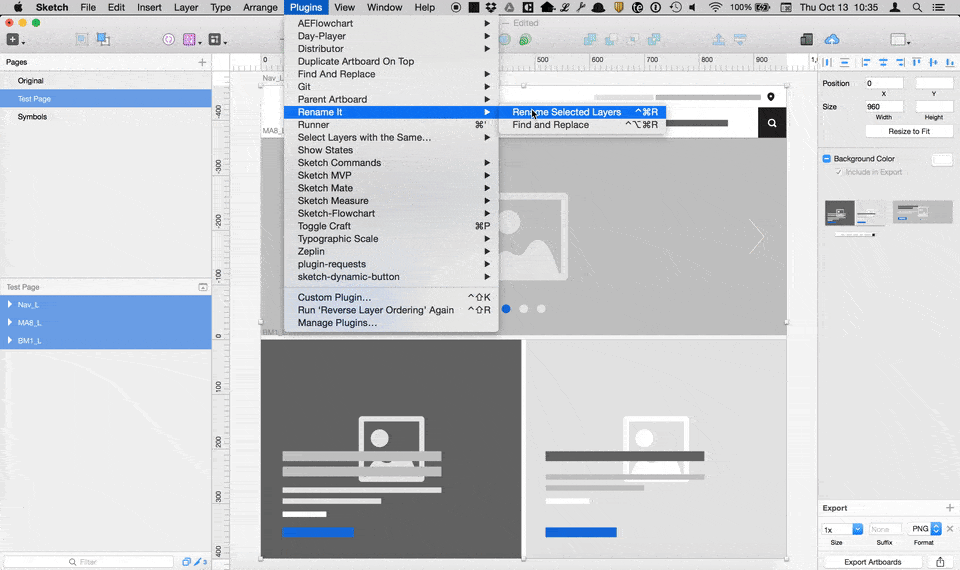
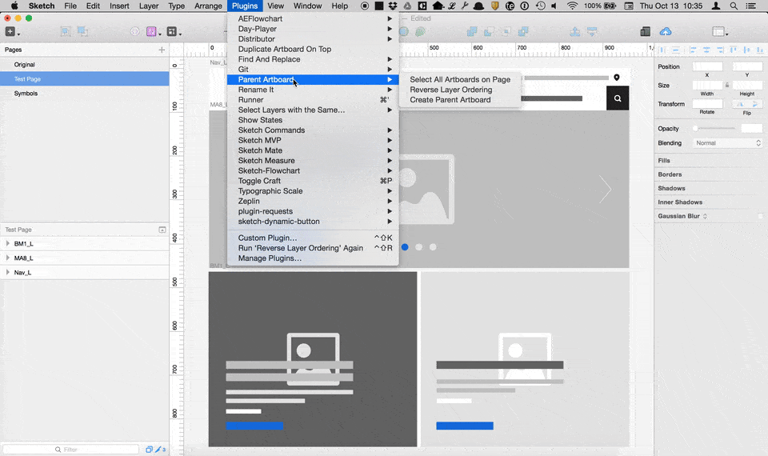
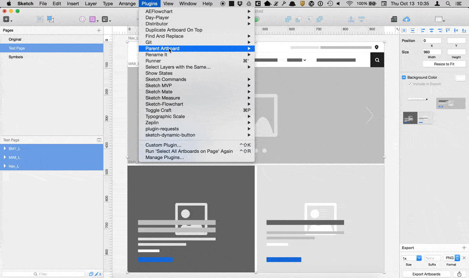

# Parent Artboard for Sketch
This is a plugin for the Sketch app. It used to create a 'parent' artboard that is the size of multiple 'children' artboards. The new parent artboard is placed below the 'children' and can be used for exporting.  

### Create Parent Artboard

It gets the height and width of all the artboards on a page and creates a new parent artboard for exporting. The new artboard is the size of all the artboards and is sent to the bottom of the layer list. By default it is made to be exportable as a PNG.

## Additional Commands

Two other commands helpful to this workflow are added in for convenience.

### Select All Artboards on a Page

The code is copied from [Sketch Commands](http://bomberstudios.github.io/sketch-commands/) a very useful collection of Sketch Commands.

### Reverse Layer Ordering

The code is copied from [Sketch Mate](https://github.com/getflourish/Sketch-Mate) another collection of very useful Sketch Commands.

